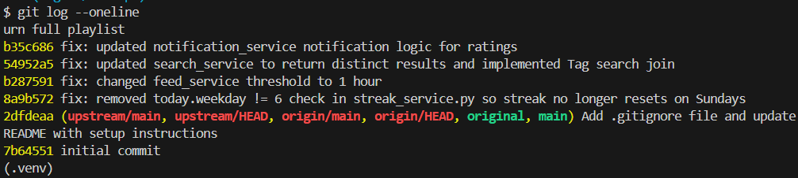
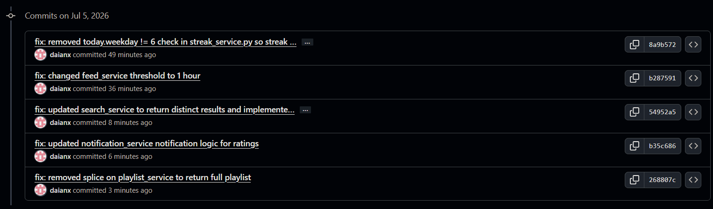

# Mixtape Bug Hunt Submission


## AI Usage
*Describe how you used AI tools during codebase navigation and debugging, what they helped you understand, and where you verified or overrode their output. Be specific about your prompts and how they helped you (e.g. asking for a function explanation, tracing a data flow). Also, describe at least one instance where the AI's explanation was incomplete or you had to course-correct.*

**Codebase Orientation:**
I used the AI assistant to help build a model of the repository before diving into the issues. I asked the AI to read through `app.py`, `models.py`, and the entire contents of the `routes/` and `services/` directories to generate high-level summaries of each file's responsibilities. For example, my prompts included requests like "Explain the architecture of this app.", "Help me summarize the files in routes and services." and "Make the summaries more detailed." I also asked the AI to generate an ER diagram of the database models. Prompts like, "Generate an ER diagram for this database schema." helped me visualize the relationships between tables.

This collaboration saved a significant amount of time in understanding the architecture—specifically how the route controllers delegate business logic to the services layer—and it successfully traced exact data flows (like how a song rating reaches the database and generates a notification).

**Bug Hunting and Test Generation:**
During the bug hunting process, I utilized the AI assistant to help generate regression tests for the bugs we were fixing. For example, I asked the AI to "create a test for bug 2" and later to verify if notifications were correctly triggered in Bug 4. The AI successfully generated `tests/test_feed.py` and `tests/test_notifications.py`, saving me a lot of coding time. 

**Course Correction:**
There was an instance where I had to course-correct the AI. While generating the test for Bug 4 (`test_notifications.py`), the AI initially asserted against `notifs[0]["notification_type"]`. This caused a `KeyError` during testing because the `to_dict()` method in `models.py` actually maps that database column to the key `"type"`. I had to point out the `KeyError: 'notification_type'` failure to the AI, which then investigated the model and corrected the assertion to `notifs[0]["type"]`.


**Project Summary:**
This submission documents the investigation, root cause analysis, and resolution of multiple bugs within the **Mixtape** application, a social music platform for sharing songs and playlists. It includes a map of the codebase architecture, detailed root cause analyses for each fixed issue, verification of fixes, and documentation of the AI-assisted debugging process.


## App Structure

```
ai201-project5-mixtape-starter/
├── app.py                      # Flask app factory and DB setup
├── models.py                   # SQLAlchemy models for all entities
├── routes/
│   ├── songs.py                # Song sharing, search, and rating routes
│   ├── playlists.py            # Playlist creation and song management
│   ├── users.py                # User profiles, streaks, notifications
│   └── feed.py                 # Friends listening now, activity feed
├── services/
│   ├── streak_service.py       # Listening streak logic
│   ├── feed_service.py         # Friends listening now feed logic
│   ├── search_service.py       # Song search logic
│   ├── notification_service.py # Notification creation and retrieval
│   └── playlist_service.py     # Playlist retrieval logic
├── tests/
│   ├── test_streaks.py
│   ├── test_search.py
│   └── test_playlists.py
├── seed_data.py                # Populates DB with test data
├── requirements.txt
└── .gitignore
```

## Codebase Map
*Identify the main files and their roles, and describe the data flow for at least one feature. (Write this before starting your bug work).*

**Database ERD:**
![[Database ERD.png]]

```text
      +------------------+                   +------------------+
  +---|       User       |                   |       Song       |
  |   +------------------+                   +------------------+
  +-->| id (PK)          | 1               * | id (PK)          |
friend| username         |-------------------| shared_by (FK)   |
ships | email            |                   | title            |
      | listening_streak |                   | artist           |
      +------------------+                   +------------------+
        |   |   |   |   |                       |   |   |   |
        |   |   |   |   |  +-----------------+  |   |   |   |
        |   |   |   |   +--| ListeningEvent  |--+   |   |   |
        |   |   |   | 1  * +-----------------+ *  1 |   |   |
        |   |   |   |                               |   |   |
        |   |   |   |      +-----------------+      |   |   |
        |   |   |   +------|     Rating      |------+   |   |
        |   |   |     1  * +-----------------+ *  1     |   |
        |   |   |                                       |   |
        |   |   |          +-----------------+          |   |
        |   |   |          |    song_tags    |----------+   |
        |   |   |          +-----------------+ *      1     |
        |   |   |                   *                       |
        |   |   |                   1                       |
        |   |   |          +-----------------+              |
        |   |   |          |       Tag       |              |
        |   |   |          +-----------------+              |
        |   |   |                                           |
        |   |   |          +-----------------+              |
        |   |   +----------|playlist_entries |--------------+
        |   |     1      * +-----------------+ *          1
        |   |                       *
        |   |                       1
        |   |              +-----------------+
        |   +--------------|    Playlist     |
        |         1      * +-----------------+
        |
        |                  +-----------------+
        +------------------|  Notification   |
                  1      * +-----------------+
```

**Main Files and Roles:**
- `app.py`: Flask application factory that initializes the app, configures the SQLite database via SQLAlchemy, and registers the blueprints for the different routes.
- `models.py`: Defines the SQLAlchemy database models (`User`, `Song`, `Playlist`, `Tag`, `Rating`, `ListeningEvent`, `Notification`) and their relationships, along with association tables for many-to-many connections.
- `routes/`: Contains the controller logic defining HTTP endpoints.
	- `songs.py`: Handles song discovery, retrieval, user ratings, and tracking listening events.
	- `playlists.py`: Handles creating playlists, retrieving playlist metadata, and adding/fetching songs within playlists.
	- `users.py`: Handles fetching user profiles and retrieving a user's notifications.
	- `feed.py`: Handles fetching the activity feed and friends' "listening now" data.
- `services/`: Contains the core business logic, interacting directly with database models.
	- `feed_service.py`: Generates the global activity feed and friends' "listening now" feed by joining listening events and friendships.
	- `notification_service.py`: Creates and retrieves notifications for events like song ratings and playlist additions.
	- `playlist_service.py`: Manages playlist operations, including resolving ordered songs and retrieving a user's playlists.
	- `search_service.py`: Implements song search functionality based on queries matching titles, artists, or tags.
	- `streak_service.py`: Tracks and updates a user's daily consecutive listening streaks.

**Data Flow Examples:**
- **A user rates a song** → `POST /songs/<song_id>/rate` → `routes/songs.py` → `notification_service.rate_song()`
  *Detail:* The route handler extracts the `user_id` and `score` from the JSON payload. It delegates to the service layer which records a new `Rating` in the database and generates a `Notification` for the user who originally shared the track.
- **A user views a playlist** → `GET /playlists/<id>/songs` → `routes/playlists.py` → `playlist_service.get_playlist_songs()`
  *Detail:* The route takes the `playlist_id` from the URL parameters. The service layer executes a SQLAlchemy query, joining the `Song` model with the `playlist_entries` association table to return a list of songs ordered by their explicit position.

---
## The Five Open Issues

| #   | Title                                                                               | Affected service          |
| --- | ----------------------------------------------------------------------------------- | ------------------------- |
| 1   | My listening streak keeps resetting                                                 | `streak_service.py`       |
| 2   | Friends Listening Now shows people from yesterday                                   | `feed_service.py`         |
| 3   | The same song keeps showing up twice in search                                      | `search_service.py`       |
| 4   | I got notified when a friend added my song to a playlist but not when they rated it | `notification_service.py` |
| 5   | The last song in a playlist never shows up                                          | `playlist_service.py`     |

## Root Cause Analyses

### Bug 1
**Issue Number and Title:** 
Issue #1: My listening streak keeps resetting

**How you reproduced it:**
I investigated the test suite and ran the existing unit test `tests/test_streaks.py`. By running the tests, it returned an Assertion error for test_streak_increments_on_sunday. The `test_streak_increments_on_sunday` test explicitly creates a scenario where a user listens on Saturday (weekday 5) and then on Sunday (weekday 6). I confirmed that the streak reset to 1 instead of properly incrementing to 2.

**How you found the root cause:**
Knowing the issue was related to streaks, I opened `services/streak_service.py` and traced the `update_listening_streak` function. I read through the streak rules and looked at the code that handles consecutive days (`days_since_last == 1`) and saw `today.weekday() != 6`. This makes it so that if the user listens on a Sunday, the streak will always reset to 1.

**The root cause:**
The code incorrectly included the condition `today.weekday() != 6` when verifying if the streak should increment for consecutive days. Because `weekday() == 6` corresponds to Sunday, any listening event occurring on a Sunday evaluated to false for the increment branch, causing the code to fall through to the `else` block which mistakenly resets the streak back to 1.

**Your fix and side-effect check:**
I removed the `and today.weekday() != 6` check from the `elif days_since_last == 1` statement. Now, any consecutive day correctly increments the streak regardless of the day of the week. I confirmed the fix didn't break anything by observing that the full `test_streaks.py` suite passed successfully. From the Streak rules, there isn't anything that would be impacted by removing the `today.weekday() != 6` check. To ensure this didn't break other streak logic, I verified that if a user listens after 2 or more days (days_since_last > 1), the code still correctly falls into the else block and resets the streak to 1. Removing the Sunday check only affected the consecutive day increment logic.  

---

### Bug 2
**Issue Number and Title:** 
Issue #2: Friends Listening Now shows people from yesterday

**How you reproduced it:**
I investigated the code for the `get_friends_listening_now` function in `feed_service.py` to understand how friends are included in the feed. The bug description stated that the feed was including events from yesterday. I mentally traced the logic and confirmed that the threshold allowed events from exactly up to 24 hours ago. I also had AI generate a test case to verify this (`tests/test_feed.py`), and it confirmed that the threshold was indeed set to 24 hours.

**How you found the root cause:**
I opened the `services/feed_service.py` file and checked the `get_friends_listening_now` function. I saw a line `cutoff = datetime.now(timezone.utc) - RECENT_THRESHOLD` which is used to filter the recent events. `RECENT_THRESHOLD` is hardcoded to `timedelta(hours=24)` at the top of the file. 

**The root cause:**
At the top of `feed_service.py`, `RECENT_THRESHOLD` is hardcoded to `timedelta(hours=24)`. This means that any listening event occurring within the last 24 hours was considered to be happening "now", causing yesterday's listening activity to be mixed into the real-time "Listening Now" feed.

**Your fix and side-effect check:**
The "Now" in Friends Listening Now isn't defined in any of the provided documents, so I chose to define it as within the last hour. I changed `RECENT_THRESHOLD` from `timedelta(hours=24)` to `timedelta(hours=1)`, which ensures only events within the last hour show up in the "Listening Now" feed. To ensure this didn't break the global activity feed, I verified that the tests now run with no problems. 

---

### Bug 3
**Issue Number and Title:** 
Issue #3: The same song keeps showing up twice in search

**How you reproduced it:**
I ran `tests/test_search.py` which contains a test called `test_search_no_duplicates_multi_tag_song`. The test comment indicates that a song with multiple tags returns duplicates in the search results (e.g., 3 results instead of 1). This test initially failed.

**How you found the root cause:**
I opened `services/search_service.py` to inspect the `search_songs` function. I saw that the SQL query was doing an outer join with `song_tags`, but it was missing a `.distinct()` call. Additionally, according to the docstring, it was supposed to search by tag names, but the query lacked a join to the `Tag` table and the tag filter entirely.

**The root cause:**
The query in `search_songs` was missing a `.distinct()` clause. Because it was joining the `song_tags` table, a song with multiple tags would return a row for each tag from the database. Without `.distinct()`, this resulted in the same song appearing multiple times in the search results. Additionally, the query was missing the ability to search by tag names, which requires joining the `Tag` table and filtering on `Tag.name`.

**Your fix and side-effect check:**
I modified the SQL query in `services/search_service.py` to add `.outerjoin(Tag, song_tags.c.tag_id == Tag.id)` and included `Tag.name.ilike(f"%{query}%")` inside the `db.or_` filter to implement the tag search functionality. I also added a `.distinct()` call to the query just before `.all()` to make sure that even if a song matches multiple tags, it will only be returned once. I verified this didn't break existing search features by running `pytest tests/test_search.py` and confirming all tests passed, including the duplication test.

---

### Bug 4 
**Issue Number and Title:** 
Issue #4: I got notified when a friend added my song to a playlist but not when they rated it

**How you reproduced it:**
I created a new test file, `tests/test_notifications.py`, and wrote a test `test_rate_song_creates_notification` to verify if a notification is generated when a friend rates a song. As expected, the test failed initially because `get_notifications()` returned an empty list.

**How you found the root cause:**
I opened `services/notification_service.py` and compared the `add_to_playlist` function with the `rate_song` function. The `add_to_playlist` function correctly checks if the current user isn't the original sharer, and calls `create_notification` to notify them. However, the `rate_song` function was missing this logic.

**The root cause:**
The `rate_song` function in `notification_service.py` successfully saved or updated the `Rating` object in the database, but it was missing the code to trigger a notification. This means that when a user rates a song, the original sharer is not notified. 

**Your fix and side-effect check:**
I added a block at the end of the `rate_song` function, before the commit, to check `if song.shared_by != user_id:`. If true, it calls `create_notification` with a "song_rated" type and a descriptive message indicating the score given. I verified the fix by running my new `tests/test_notifications.py` test suite, which passed successfully, confirming that rating a song now correctly notifies the original sharer. No side effects were observed as the fix does not interfere with any existing functionality. 

---

### Bug 5
**Issue Number and Title:** 
Issue #5: The last song in a playlist never shows up

**How you reproduced it:**
I reviewed `tests/test_playlists.py` and saw `test_playlist_returns_all_songs` which indicates that returning songs for a playlist with 5 songs should return exactly 5 songs. There was a comment on the test noting that it returned 4 instead of 5, which matched the bug description of the last song being missing.

**How you found the root cause:**
I opened `services/playlist_service.py` to check the `get_playlist_songs` function since that's what the failing test was calling. In the very last return statement, the list comprehension was slicing the list with `[:-1]`. This will cause the last song to be excluded from the returned list.

**The root cause:**
In `get_playlist_songs` within `playlist_service.py`, the return statement used python slicing `songs[:-1]`. Slicing a list this way drops the last element. Because of this, the final song in every playlist was not returned in the results.

**Your fix and side-effect check:**
I removed the `[:-1]` slice from the return statement in `get_playlist_songs`, changing it to just `return [song.to_dict() for song in songs]`. I then ran the test suite using `pytest tests/test_playlists.py` and verified that `test_playlist_returns_all_songs` passed, returning the correct number of songs. I also verified no other tests failed, confirming no unintended side effects. I verified that if a playlist is completely empty (0 songs), the modified logic [song.to_dict() for song in songs] correctly returns an empty list [] instead of throwing an index or slice error. I also verified that a playlist with exactly 1 song correctly returns that 1 song instead of returning 0 songs.

---

## Regression Test
*Reference a test you wrote that would have caught one of the fixed bugs before it was introduced. Briefly explain what behavior it verifies and why that test would have failed against the buggy code.*

**Test File & Name (Example 1):** 
`tests/test_notifications.py` -> `test_rate_song_creates_notification()`

**Explanation:**
This test validates that when a user rates a song shared by another user, a "song_rated" notification is accurately generated for the original sharer. It does this by creating a mock song and two mock users, having the second user rate the song, and then verifying the original user's notification list length is exactly 1 with the correct type. Before the bug fix in `notification_service.py`, this test would fail because the notification list was completely empty (`0 == 1`), thereby catching the missing `create_notification` call in the rating logic.

**Test File & Name (Example 2):** 
`tests/test_feed.py` -> `test_friends_listening_now_excludes_old_events()`

**Explanation:**
This test validates that the "Listening Now" feed accurately enforces a 1-hour time threshold for listening events. It creates two scenarios: an event that happened 30 minutes ago, and an event that happened 2 hours ago. It asserts that only the 30-minute event shows up in the feed. Before the fix in `feed_service.py`, this test would fail on the 2-hour event check (it would return a list of length 1 instead of 0) because the service had a hardcoded `timedelta(hours=24)` threshold, causing yesterday's events to be incorrectly mixed into the "Listening Now" feed.

---

## Git Log Screenshot





Git Log Output:
```
268807c (HEAD -> bugfix/mixtape, origin/bugfix/mixtape) fix: removed splice on playlist_service to return full playlist
b35c686 fix: updated notification_service notification logic for ratings
54952a5 fix: updated search_service to return distinct results and implemented Tag search join
b287591 fix: changed feed_service threshold to 1 hour
8a9b572 fix: removed today.weekday != 6 check in streak_service.py so streak no longer resets on Sundays
2dfdeaa (upstream/main, upstream/HEAD, origin/main, origin/HEAD, original, main) Add .gitignore file and update README with setup instructions
7b64551 initial commit
(.venv) 
```
